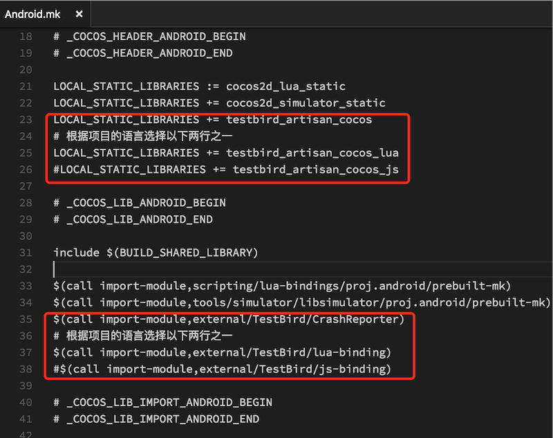
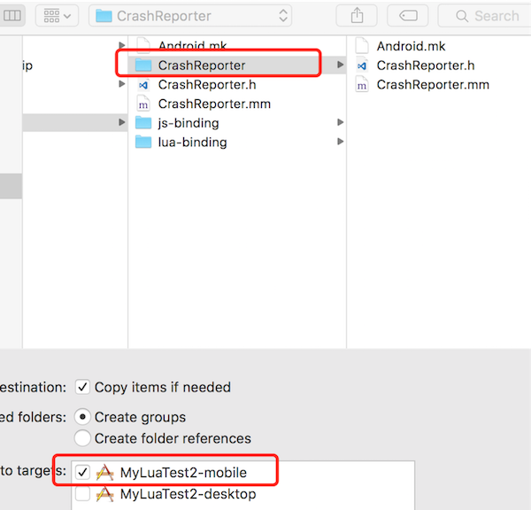
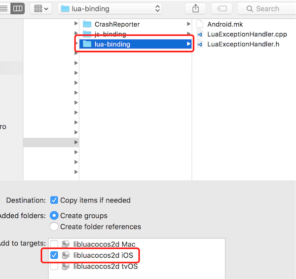
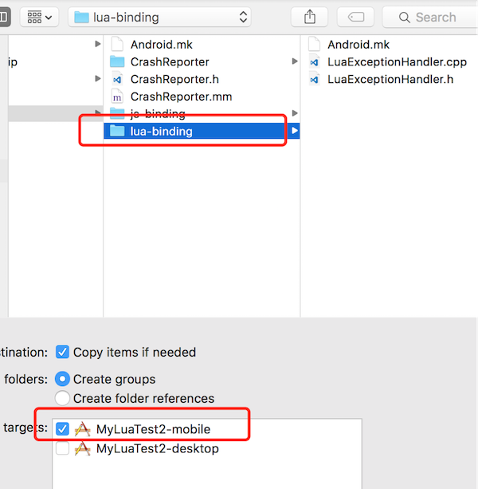

## 简介
TestBird Cocos Plugin 为Cocos 提供访问TestBird 崩溃分析SDK 的一系列接口，
并提供Lua/Javascript 的异常捕捉上报功能。

**要使用Cocos Plugin 需要集成TestBird 崩溃分析SDK**

## 添加Cocos Plugin 插件到cocos 工程

### 将TestBird 目录拷贝到external 目录下
> Cocos 项目引用Cocos 的模式一般有两种，external 的位置有所不同：
> * *源码模式*：external 目录位于工程目录下的 frameworks/cocos2d-x
> * *静态库模式*：external 目录位于cocos 源码目录下

### 为Android 项目添加Cocos Plugin
用文本编辑器打开以下文件：
```
frameworks/runtime-src/proj.android/jni/Android.mk
```
在文件中添加引用Cocos Plugin

* 在`include $(BUILD_SHARED_LIBRARY)`之前添加：
```
LOCAL_STATIC_LIBRARIES += testbird_artisan_cocos
# 根据项目的语言（lua/javascript）选择以下两行之一
LOCAL_STATIC_LIBRARIES += testbird_artisan_cocos_lua
LOCAL_STATIC_LIBRARIES += testbird_artisan_cocos_js
```
* 在`include $(BUILD_SHARED_LIBRARY)`之后添加：
```
$(call import-module,external/TestBird/CrashReporter)
# 根据项目的语言（lua/javascript）选择以下两行之一
$(call import-module,external/TestBird/lua-binding)
$(call import-module,external/TestBird/js-binding)
```
如下图：



### 为iOS 项目添加Cocos Plugin
1.  用Xcode 打开iOS 工程 `frameworks/runtime-src/proj.ios_mac/YouAppName.xcodeproj`
2.  将CrashReport 添加到iOS 工程，如下图：

    

3.  添加lua-binding 或者 js-binding 到iOS 工程

    根据引用Cocos 的不同模式，需要不同的添加方法：

    *   源码模式，将lua-binding 或者 js-binding 添加到cocos2d_lua_bindings 或者cocos2d_js_bindings 子工程

        

    *   静态库模式，将lua-binding 或者 js-binding 直接添加到iOS工程

        

### 在`AppDelegate.cpp`中启用TestBird Cocos Plugin
1.  首先在 `frameworks/runtime-src/Classes/AppDelegate.cpp` 添加头文件引用：
    ```c++
    #include "TestBird/CrashReporter/CrashReporter.h"
    ```
    Lua 工程需要添加：
    ```c++
    #include "TestBird/lua-binding/LuaExceptionHandler.h"
    ```
    Javascript 工程需要添加：
    ```c++
    #include "TestBird/js-binding/JSExceptionHandler.h"
    ```
2.  在 `bool AppDelegate::applicationDidFinishLaunching()` 函数中初始化Cocos Plugin
    ```c++
    TestBird::CrashReporter::enableDebug(true);
    #if (CC_TARGET_PLATFORM == CC_PLATFORM_IOS)
    TestBird::CrashReporter::initWithAppKey("YourAppKey", NULL);
    #elif (CC_TARGET_PLATFORM == CC_PLATFORM_ANDROID)
    TestBird::CrashReporter::initWithAppKey("YourAppKey", "Channel");
    #endif
    ```
3.  在初始化Cocos Plugin 之后注册 Lua/Javascript 函数

    Lua：
    ```c++
    TestBird::LuaExceptionHandler::registerLuaExceptionHandler();
    ```
    Javascript:
    ```c++
    sc->addRegisterCallback(TestBird::JSExceptionHandler::registerJSExceptionHandler);
    ```
4.  在Lua脚本中定义异常处理函数(Javascript 工程可略过)

    在`src/main.lua` 文件中添加如下代码：

    **需要在 xpcall 之前添加**
    ```lua
    __G__TRACKBACK__ = function(msg)
        TestBirdOnLuaException(tostring(msg), debug.traceback())
        return msg
    end
    ```
### API说明

*   TestBirdReportCaughtException
    上报被捕获的异常

    函数定义：

    Javascript:

    ```Javascript
    function TestBirdReportCaughtException(name, reason, stack)
    ```
    Lua:
    ```lua
    function TestBirdReportCaughtException(message, stack)
    ```

    示例：

    Javascript：
    ```javascript
    try {
        // some error here
    } catch (err) {
        TestBirdReportCaughtException(err.name, err.message, err.stack)
    }
    ```
    Lua:
    ```lua
    TestBirdReportCaughtException("custom exception", "")
    ```
*   TestBirdSetUserId

    设置用户标示

    函数定义：
    ```javascript
    function TestBirdSetUserId(userid)
    ```
*   TestBirdAddCustomLog

    添加一条自定义log

    函数定义：
    ```javascript
    function TestBirdAddCustomLog(log)
    ```
*   TestBirdSetCustomKey

    添加一条自定义键值对纪录

    函数定义：
    ```javascript
    function TestBirdSetCustomKey(key, value)
    ```
*   TestBirdRemoveCustomKey

    移除一条自定义键值对纪录

    函数定义：
    ```javascript
    function TestBirdRemoveCustomKey(key)
    ```
*   TestBirdRemoveCustomKey

    清除所有自定义键值对纪录

    函数定义：
    ```javascript
    function TestBirdRemoveCustomKey()
    ```
